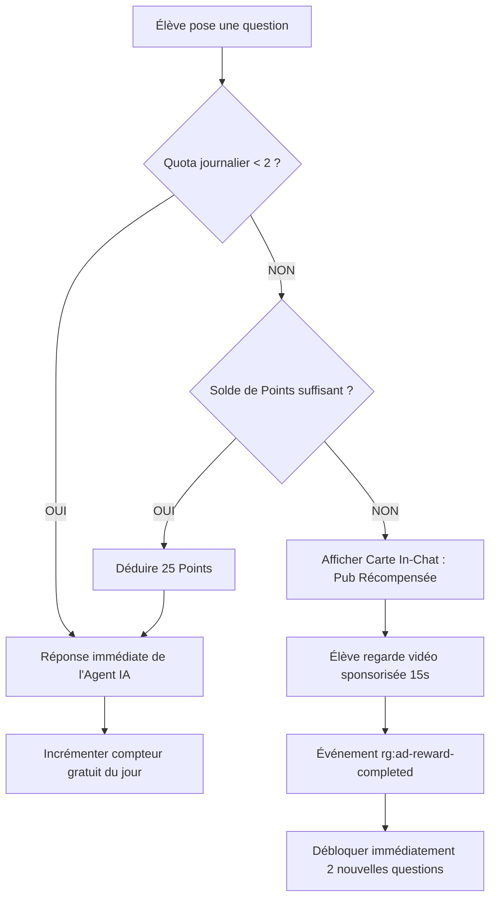

# DeepSeek AI Production Integration Skill (V4 Flash, Vision & Tuteur EdTech)

Ce guide est le référentiel technique standard pour intégrer l'**API DeepSeek** de façon **ultra-économique, ultra-rapide et rentable**.
Il a été forgé à partir des retours d'expérience réels et des correctifs appliqués sur **RG Play** (plateforme de streaming de livres audio et e-books) et est directement transposable sur des plateformes éducatives comme **Iziteach.com** (cours en ligne, tuteur pédagogique, correction de devoirs par photo, quiz interactifs).

---

## 1. Vue d'Ensemble & Modèles DeepSeek V4

L'API DeepSeek offre l'un des meilleurs rapports performance/prix du marché mondial de l'IA. Cependant, **le choix précis du modèle est capital** pour éviter de multiplier ses coûts par 20.

### Tableau Comparatif des Modèles

| Modèle | ID Exact de l'API | Usage Recommandé | Coût estimé (Tokens) | Latence |
| :--- | :--- | :--- | :--- | :--- |
| **DeepSeek V4 Flash** *(Recommandé)* | `deepseek-v4-flash` | Chat, tuteur, résumés, quiz, recherche sémantique, 95% des besoins EdTech. | **~0.14 $ / 1M input**<br>**~0.28 $ / 1M output** | Ultra-rapide (~300-800ms) |
| **DeepSeek V4 Flash Vision** *(Recommandé)* | `deepseek-v4-flash-vision-exp` | Multimodal : photo de couverture de livre, photo d'exercice manuscrit, schéma, tableau. | **Très économique** (tarif Flash) | Rapide (~1.2s - 2s) |
| **DeepSeek V4 Pro / Reasoner** *(À restreindre)* | `deepseek-v4-pro` ou `deepseek-reasoner` | Démonstrations mathématiques très complexes niveau doctorat, raisonnement lourd. | **x10 à x20 plus cher** que Flash | Lente (chaîne de pensée longue) |

---

## 2. LES 7 ERREURS CRITIQUES COMMISES & À ÉVITER ABSOLUMENT

> [!CAUTION]
> Lors des premières phases sur RG Play, un test solo de quelques requêtes a engendré une surconsommation anormale de **0.32 $**, dont **94% sur le modèle Pro** ! Voici les causes exactes et comment les bannir définitivement sur Iziteach et vos futurs projets.

### ❌ Erreur #1 : L'utilisation naïve de l'alias `"deepseek-chat"`
* **Le Piège :** Selon la documentation générique OpenAI-compatible de DeepSeek, beaucoup de développeurs configurent `"model": "deepseek-chat"`. Or, dans le backend DeepSeek, cet alias est fréquemment routé vers le modèle **`deepseek-v4-pro`** (plus intelligent, mais 10x à 20x plus cher).
* **Conséquence :** 94% de vos jetons sont facturés au tarif Pro sans que vous ne vous en rendiez compte.
* **Bonne Pratique :** Verrouillez TOUJOURS en dur le nom de version exacte :
  ```javascript
  // ❌ À BANNIR
  model: "deepseek-chat"
  
  // ✅ OBLIGATOIRE POUR LE TEXTE
  model: "deepseek-v4-flash"

  // ✅ OBLIGATOIRE POUR LES IMAGES
  model: "deepseek-v4-flash-vision-exp"
  ```

---

### ❌ Erreur #2 : Ne pas plafonner `max_tokens` (Le syndrome du "Bavardage")
* **Le Piège :** Par défaut, DeepSeek peut générer des réponses encyclopédiques de 1500 à 4000 tokens pour une simple question.
* **Conséquence :** Explosion des tokens de sortie (qui coûtent 2x plus cher que les tokens d'entrée) et temps de réponse trop long pour un élève sur mobile.
* **Bonne Pratique :** Fixer un `max_tokens` strict adapté à chaque fonctionnalité :
  * Assistant de chat / Tuteur : `max_tokens: 450` à `500`
  * Recherche sémantique / Matching : `max_tokens: 200` à `250`
  * Génération de question quiz : `max_tokens: 300`

---

### ❌ Erreur #3 : Transmettre l'intégralité de l'historique de discussion
* **Le Piège :** Renvoyer tout le tableau `messages` du chat (qui contient parfois 20 ou 30 échanges) à chaque nouvelle question.
* **Conséquence :** À la 20e question, vous payez pour ré-ingérer 8 000 tokens de contexte passé pour obtenir une simple réponse de 100 mots.
* **Bonne Pratique :** Implémenter une **fenêtre glissante** ne conservant que les **2 à 4 derniers messages** :
  ```javascript
  // Conserver uniquement les 4 derniers échanges
  const recentHistory = (messages || [])
    .slice(-4)
    .map(m => ({
      role: m.role === 'user' ? 'user' : 'assistant',
      content: typeof m.content === 'string' ? m.content.slice(0, 600) : ''
    }));
  ```

---

### ❌ Erreur #4 : Envoyer des photos HD brutes (3 à 10 Mo) à la Vision
* **Le Piège :** Transmettre directement le fichier issu de l'appareil photo d'un smartphone moderne (4000x3000px, 6 Mo en base64).
* **Conséquence :** 
  1. Crash sur réseau mobile 3G/4G instable.
  2. Dépassement des limites de payload HTTP (413 Payload Too Large).
  3. Temps de transfert de 10 secondes.
* **Bonne Pratique :** Redimensionner et compresser l'image **côté client en Javascript via Canvas HTML5** avant l'envoi :
  * Largeur/hauteur max : `800 px`
  * Format : `JPEG`
  * Qualité : `0.72`
  * Résultat : Une image ultra-nette de **35 Ko à 60 Ko**, transmise en 100ms et analysée pour **~200 tokens seulement** !

---

### ❌ Erreur #5 : Tenter de faire de l'OCR lourd côté client (Tesseract.js)
* **Le Piège :** Télécharger une bibliothèque d'OCR locale comme `Tesseract.js` (15 Mo de modèles binaires) dans le navigateur pour économiser l'API vision.
* **Conséquence :** Les téléphones d'élèves (Tecno, Infinix, Samsung entrée de gamme) gèlent, vident leur forfait data pour télécharger le modèle de 15 Mo, et le taux d'abandon dépasse 80%.
* **Bonne Pratique :** Laisser le modèle `deepseek-v4-flash-vision-exp` faire l'analyse. À $0.14 par million de tokens, analyser une image compressée coûte **moins de 0.00004 $** (environ **0,02 FCFA**). C'est 100x plus rapide, plus précis et totalement invisible pour l'utilisateur.

---

### ❌ Erreur #6 : Mettre en place un Fallback aveugle vers un modèle Pro ou OpenAI
* **Le Piège :** Si l'appel échoue, rediriger automatiquement vers `deepseek-v4-pro` ou `gpt-4o`.
* **Conséquence :** Lors d'un pic de latence, toutes vos requêtes basculent sur le modèle le plus cher, faisant sauter votre budget.
* **Bonne Pratique :** Pas de bascule automatique vers un modèle Pro. Si l'API rencontre un problème, afficher un message d'attente convivial avec un bouton pour réessayer, ou réessayer une seule fois sur le même modèle Flash.

---

### ❌ Erreur #7 : Exposer la clé API DeepSeek dans le Frontend
* **Le Piège :** Appeler `https://api.deepseek.com/chat/completions` directement depuis React/Vue avec la clé secrète dans le code client.
* **Conséquence :** Vol de la clé API en ouvrant simplement l'inspecteur réseau du navigateur.
* **Bonne Pratique :** Toutes les requêtes DeepSeek doivent transiter par votre serveur ou une Cloudflare Function (`/api/ai/chat`, `/api/ai/vision`), où la variable d'environnement `DEEPSEEK_API_KEY` reste 100% secrète.

---

## 3. Modèle Freemium Rentable : Transformer l'IA en Centre de Profit

Ne proposez jamais une IA en accès illimité sans barrière. Voici la mécanique éprouvée sur RG Play :



### Le Calcul de Rentabilité Réel
* **Coût IA pour 1 000 requêtes DeepSeek Flash** : **~0,15 $** (environ 95 FCFA).
* **Revenu publicitaire de 500 vues de vidéos sponsorisées** (eCPM de 2.00 $ à 4.00 $ en Afrique / Europe) : **1,00 $ à 2,00 $**.
* **Bénéfice Net :** L'utilisateur a une expérience 100% gratuite, et la plateforme génère un **profit net de 5x à 10x le coût de l'API** !

---

## 4. Code Backend de Référence (Cloudflare Pages Function / Express)

Voici l'architecture propre implémentée dans RG Play, prête à être copiée/adaptée pour **Iziteach.com** :

```javascript
// functions/api/ai/chat.js (ou Express router.post('/api/ai/chat'))

export async function handleAiChat(req, env) {
  const DEEPSEEK_API_KEY = env.DEEPSEEK_API_KEY || process.env.DEEPSEEK_API_KEY;
  if (!DEEPSEEK_API_KEY) {
    return { success: false, error: "Clé DeepSeek non configurée" };
  }

  const {
    user_message = "",
    messages = [],
    context_data = {},    // Ex: Cours Iziteach, chapitre, niveau d'étude
    image_base64 = null,  // Image compressée en data:image/jpeg;base64,...
  } = await req.json();

  const hasImage = Boolean(image_base64);

  // 1. Verrouillage strict des modèles
  const model = hasImage ? "deepseek-v4-flash-vision-exp" : "deepseek-v4-flash";
  const maxTokens = hasImage ? 500 : 450;

  // 2. Prompt Système Pédagogique (Exemple Iziteach / RG Play)
  const systemPrompt = `Tu es le Tuteur Intelligent officiel d'Iziteach (ou RG Play).
RÈGLES D'OR :
1. Sois clair, concis, bienveillant et structuré avec du markdown aéré.
2. Si une image est fournie (ex: devoir, livre, formule), identifie-la avec précision et explique pas à pas la solution.
3. Ne donne pas une réponse fleuve : va droit au but (max 3-4 paragraphes courts ou listes à puces).
4. Si un cours ou livre du catalogue correspond, termine en mentionnant sa référence exacte.`;

  // 3. Fenêtre glissante d'historique (max 4 messages récents)
  const recentHistory = messages
    .filter(m => m.role === 'user' || m.role === 'assistant')
    .slice(-4)
    .map(m => ({
      role: m.role,
      content: typeof m.content === 'string' ? m.content.slice(0, 600) : ''
    }));

  // 4. Construction du message utilisateur (Multimodal si image)
  let userPayload;
  if (hasImage) {
    userPayload = {
      role: "user",
      content: [
        {
          type: "text",
          text: user_message || "Peux-tu analyser cette image et m'expliquer son contenu ?"
        },
        {
          type: "image_url",
          image_url: {
            url: image_base64.startsWith("data:") 
              ? image_base64 
              : `data:image/jpeg;base64,${image_base64}`
          }
        }
      ]
    };
  } else {
    userPayload = {
      role: "user",
      content: user_message
    };
  }

  // 5. Appel API DeepSeek
  const response = await fetch("https://api.deepseek.com/chat/completions", {
    method: "POST",
    headers: {
      "Content-Type": "application/json",
      "Authorization": `Bearer ${DEEPSEEK_API_KEY}`
    },
    body: JSON.stringify({
      model,
      messages: [
        { role: "system", content: systemPrompt },
        ...recentHistory,
        userPayload
      ],
      max_tokens: maxTokens,
      temperature: 0.5,
      stream: false
    })
  });

  if (!response.ok) {
    const errText = await response.text();
    console.error("Erreur DeepSeek API:", response.status, errText);
    return { success: false, error: "Erreur du tuteur IA, veuillez réessayer." };
  }

  const data = await response.json();
  const reply = data.choices?.[0]?.message?.content || "";

  return {
    success: true,
    reply,
    model,
    usage: data.usage
  };
}
```

---

## 5. Composant Client : Compression Canvas & Envoi (React)

Voici la fonction de compression Javascript sans aucune dépendance lourde, exécutable sur n'importe quel smartphone :

```javascript
// src/utils/imageCompressor.js

/**
 * Compresse une image côté client pour l'API DeepSeek Vision
 * @param {File} file - Fichier sélectionné par l'utilisateur
 * @param {number} maxDimension - Taille maximale (largeur ou hauteur), ex: 800px
 * @param {number} quality - Qualité de compression JPEG (0.72)
 * @returns {Promise<string>} Base64 data URL prête pour l'API
 */
export const compressImageForVision = (file, maxDimension = 800, quality = 0.72) => {
  return new Promise((resolve, reject) => {
    if (!file.type.startsWith('image/')) {
      return reject(new Error("Le fichier n'est pas une image"));
    }

    const reader = new FileReader();
    reader.onload = (e) => {
      const img = new Image();
      img.onload = () => {
        let { width, height } = img;

        // Calcul du ratio pour ne pas dépasser maxDimension
        if (width > maxDimension || height > maxDimension) {
          if (width > height) {
            height = Math.round((height * maxDimension) / width);
            width = maxDimension;
          } else {
            width = Math.round((width * maxDimension) / height);
            height = maxDimension;
          }
        }

        const canvas = document.createElement('canvas');
        canvas.width = width;
        canvas.height = height;
        const ctx = canvas.getContext('2d');
        ctx.drawImage(img, 0, 0, width, height);

        // Export en JPEG léger
        const dataUrl = canvas.toDataURL('image/jpeg', quality);
        resolve(dataUrl);
      };
      img.onerror = reject;
      img.src = e.target.result;
    };
    reader.onerror = reject;
    reader.readAsDataURL(file);
  });
};
```

---

## 6. Guide d'Application Spécifique pour Iziteach.com

Pour transposer cette intégration sur **Iziteach.com** :

### Cas d'Usage #1 : Le "Tuteur Socratique" de Cours
* **Objectif :** Aider l'étudiant à comprendre un concept difficile sans lui rédiger directement son devoir à sa place.
* **Prompt Spécifique Iziteach :**
  ```text
  Tu es le Tuteur Pédagogique d'Iziteach.com pour le cours : "{course_title}".
  Niveau des étudiants : {student_level}.
  RÈGLE MÉTHODOLOGIQUE :
  - Utilise la méthode socratique : pose des questions directrices, décompose les problèmes en étapes simples.
  - Utilise des analogies de la vie quotidienne pour expliquer les concepts abstraits.
  - Termine toujours par une mini-question d'application pour vérifier la compréhension.
  ```

### Cas d'Usage #2 : Correction & Explication de Devoir par Photo (Vision)
* L'étudiant prend en photo sa feuille d'exercice ou un schéma de géométrie.
* `deepseek-v4-flash-vision-exp` lit l'énoncé manuscrit ou imprimé, repère les erreurs de calcul de l'étudiant et lui indique précisément :
  1. Ce qui est correct.
  2. La ligne exacte où se trouve l'erreur.
  3. L'indice pour rectifier lui-même.

### Cas d'Usage #3 : Générateur Express de Quiz & Flashcards
* En fixant `max_tokens: 300` et un prompt demandant un format JSON strict :
  ```json
  {
    "question": "Quelle est l'unité de mesure de la résistance électrique ?",
    "options": ["Ampère", "Volt", "Ohm", "Watt"],
    "correct_index": 2,
    "explanation": "L'Ohm (symbole Ω) mesure la résistance d'un conducteur."
  }
  ```

---

## 7. Checklist Avant Déploiement en Production

- [x] Aucun appel ne contient `"model": "deepseek-chat"` (remplacé par `"deepseek-v4-flash"`).
- [x] Le modèle vision est explicitement `"deepseek-v4-flash-vision-exp"`.
- [x] Les tokens de sortie (`max_tokens`) sont plafonnés entre 250 et 500.
- [x] L'historique des messages est tronqué aux 2 à 4 derniers échanges (`messages.slice(-4)`).
- [x] Les photos sont redimensionnées côté client via HTML5 Canvas (max 800px, JPEG 0.72) avant upload.
- [x] La clé API DeepSeek se trouve exclusivement dans les variables d'environnement serveur.
- [x] Le quota freemium (2 questions gratuites/jour) avec publicité récompensée est actif pour rentabiliser l'infrastructure.
