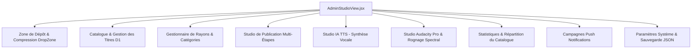
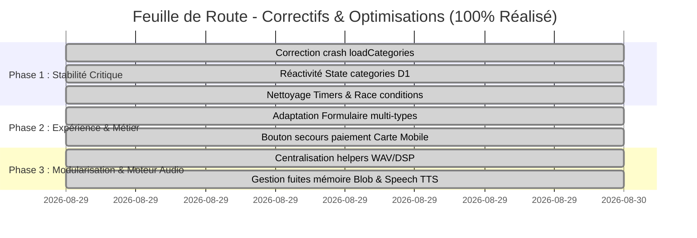

# 🩺 RAPPORT D'AUDIT CHIRURGICAL, BUGS ET DETTE TECHNIQUE
## Plateforme RG Play — Audit de Stabilité, Moteur Audio DSP & Console Admin

> **Version du document :** 1.0.0  
> **Date de réalisation :** 29 Août 2026  
> **Fichier principal ciblé :** `src/views/AdminStudioView.jsx` (2 817 lignes / 144 Ko)  
> **Environnement :** React (Vite), Cloudflare Pages Functions, Cloudflare D1 (SQL), Cloudflare R2 (Audio/Images), Cloudflare KV & CamerPay.

---

## 📑 TABLE DES MATIÈRES
1. [Vue d'Ensemble & Architecture Globale](#1-vue-densemble--architecture-globale)
2. [Analyse Détaillée du Monolithe `AdminStudioView.jsx`](#2-analyse-détaillée-du-monolithe-adminstudioviewjsx)
3. [Inventaire des Bugs Identifiés & Risques Runtime](#3-inventaire-des-bugs-identifiés--risques-runtime)
4. [Fonctionnalités Inachevées & Dette Technique (WIP)](#4-fonctionnalités-inachevées--dette-technique-wip)
5. [Performance, Fuites Mémoire & Concurrence](#5-performance-fuites-mémoire--concurrence)
6. [Plan de Correction et Feuille de Route Chirurgicale](#6-plan-de-correction-et-feuille-de-route-chirurgicale)

---

## 1. VUE D'ENSEMBLE & ARCHITECTURE GLOBALE

L'application **RG Play** est une Progressive Web App (PWA) de streaming audio, podcasts, musiques et masterclasses, optimisée pour le marché africain avec intégration directe de **CamerPay (Mobile Money Orange/MTN et Carte bancaire)**.

### Architecture Technique :
* **Frontend :** Single Page Application React 19 avec TailwindCSS, Lucide Icons, Canvas Audio Waveform et Web Audio API.
* **Backend Edge :** Cloudflare Pages Functions (`functions/api/[[route]].js`) exécuté sur le réseau mondial Cloudflare Workers.
* **Persistance & Stockage :**
  - **Base Relationnelle :** Cloudflare D1 (SQLite distribué) pour les tables `audiobooks`, `chapters`, `categories`, `orders`, `progress`, `push_subscriptions`.
  - **Cache Sub-10ms :** Cloudflare KV pour les sessions de streaming, le cache catalogue et les états de paiement.
  - **Stockage Audio / Pochette :** Cloudflare R2 (compatible S3) avec support du streaming par tranches HTTP `Range: bytes=...`.

---

## 2. ANALYSE DÉTAILLÉE DU MONOLITHE `AdminStudioView.jsx`

Le fichier [`src/views/AdminStudioView.jsx`](file:///c:/Users/SYGMA-TECH/Documents/RG%20Play/src/views/AdminStudioView.jsx) regroupe à lui seul plus de **2 800 lignes de code**. Il remplit le rôle d'un **"God Object"** centralisant :



### Découpage des sections du fichier :
| Lignes | Rubrique / Rôle | Responsabilité |
| :--- | :--- | :--- |
| **1 – 67** | Imports & Utilitaires R2 | Dépendances Lucide, formatage, Upload XHR progressif |
| **68 – 330** | Composant `DropZone` | Drag-and-drop, compression WebP/MP3 et détection durée |
| **331 – 685** | Initialisation & Publication | State React, `handlePublish`, suppression, édition, moteur TTS |
| **686 – 1075** | Moteur DSP Audacity & WAV | Fusion de pistes, filtres Biquad, Trimmer spectral, Encodage PCM WAV |
| **1076 – 1515** | Rendu Catalogue & Titres | Grille de petites cartes, vue liste détaillée, bouton pré-écoute |
| **1516 – 1899** | Formulaire Publication (4 étapes) | Métadonnées, upload couverture/extrait, gestion chapitres |
| **1900 – 2025** | Rubrique Studio IA (TTS) | Interface de génération de voix humaine |
| **2026 – 2369** | Rubrique Studio Audacity Pro | Interface découpe (Trim/Cut Out), sliders et Canvas Waveform |
| **2370 – 2530** | Rubrique Catalogues & Catégories | Formulaire et liste des catégories |
| **2531 – 2616** | Rubrique Statistiques & Ventes | KPIs catalogue, répartition et vue d'ensemble |
| **2617 – 2740** | Rubrique Notifications Push | Test local et diffusion serveur aux abonnés |
| **2741 – 2817** | Rubrique Paramètres Système | Diagnostic connecteurs D1/R2 et export JSON |

---

## 3. INVENTAIRE DES BUGS IDENTIFIÉS & RISQUES RUNTIME

### 🔴 3.1. BUG BLOQUANT : `ReferenceError: loadCategories is not defined`
* **Emplacement :** `AdminStudioView.jsx` — Ligne 982 et Ligne 992
* **Description :**
  Lorsqu'un administrateur tente de créer, mettre à jour ou supprimer une catégorie dans la rubrique *« Gestion des Catalogues & Catégories »*, les fonctions `handleSaveCategory` et `handleDeleteCategory` appellent `await loadCategories();`.
  Cette fonction n'est définie nulle part dans le composant.
* **Conséquence :** Crash immédiat de l'interface avec erreur JavaScript non interceptée.
* **Correction requise :**
  1. Déclarer la fonction `loadCategories` connectée à `apiClient.getCategories()`.
  2. Mettre à jour l'état réactif local.

---

### 🔴 3.2. BUG DE SYNCHRONISATION : Catégories codées en dur (Non Réactives)
* **Emplacement :** `AdminStudioView.jsx` — Lignes 492 à 499
* **Description :**
  La variable `categories` est instanciée comme une constante statique :
  ```javascript
  const categories = [
    { id: 'cat-1', name: 'Business & Finance' },
    { id: 'cat-2', name: 'Développement Personnel' },
    { id: 'cat-3', name: 'Intelligence Artificielle & Tech' },
    ...
  ];
  ```
* **Conséquence :** 
  - Les nouvelles catégories créées dans Cloudflare D1 n'apparaissent jamais dans le menu déroulant lors de la publication d'un livre.
  - La suppression ou modification d'une catégorie ne met pas à jour l'interface.
* **Correction requise :**
  Remplacer par `const [categories, setCategories] = useState([]);` avec chargement initial dans `useEffect`.

---

### 🟠 3.3. RACE CONDITION : Timer d'Écoute Sélective du Trimmer Audio
* **Emplacement :** `AdminStudioView.jsx` — Lignes 2247 à 2251
* **Description :**
  La lecture de la portion découpée utilise un `setTimeout` orphelin :
  ```javascript
  setTimeout(() => {
    if (dspAudioRef.current && !dspAudioRef.current.paused) {
      dspAudioRef.current.pause();
    }
  }, Math.max(500, durationToPlay * 1000));
  ```
* **Conséquence :** Si l'utilisateur clique plusieurs fois ou change de segment, les anciens timers ne sont pas nettoyés et coupent la lecture en plein milieu de manière imprévisible.
* **Correction requise :** Mémoriser l'identifiant du timer dans un `trimTimeoutRef = useRef(null)` et exécuter `clearTimeout(trimTimeoutRef.current)` avant tout nouveau déclenchement.

---

### 🟠 3.4. PROBLÈME ERGONOMIQUE MOBILE : Blocage de Popup sur Paiement Carte Bancaire
* **Emplacement :** `src/components/CheckoutModal.jsx` — Ligne 152
* **Description :**
  L'instruction `window.open(url, '_blank')` est exécutée après une promesse asynchrone (`await apiClient.initiatePayment`). Les navigateurs modernes sur mobile (iOS Safari, Android Chrome) bloquent systématiquement les ouvertures de fenêtre non déclenchées immédiatement par un geste synchrone.
* **Conséquence :** L'acheteur reste bloqué sur l'état d'attente sans que l'interface de paiement bancaire ne s'ouvre.
* **Correction requise :** Proposer un bouton de repli évident dans le modal : *« Cliquer ici pour ouvrir la page de paiement sécurisée »*.

---

## 4. FONCTIONNALITÉS INACHEVÉES & DETTE TECHNIQUE (WIP)

### 🟡 4.1. Adaptation du Formulaire de Publication selon le Type de Contenu
* **Problème :** Bien que l'application propose 4 types de contenus (*Livre Audio*, *Podcast*, *Musique*, *Masterclass*), le formulaire de publication n'adapte que le placeholder du titre.
* **Spécifications d'adaptation requises :**

| Type de Contenu | Label Champ 1 | Label Champ 2 | Label Chapitres | Placeholder Titre |
| :--- | :--- | :--- | :--- | :--- |
| **📚 Livre Audio** | Auteur * | Narrateur / Voix | Chapitres Audio | *Ex : L'Art de la Stratégie* |
| **🎙️ Podcast** | Hôte / Producteur * | Invité(s) de l'émission | Épisodes / Segments | *Ex : Tech Pulse Afrique #12* |
| **🎵 Musique & Lofi** | Artiste / Compositeur * | Featuring / Instruments | Pistes / Morceaux | *Ex : Lofi Midnight Focus* |
| **🎓 Masterclass** | Instructeur / Expert * | Niveau / Spécialité | Modules & Ateliers | *Ex : Masterclass IA Générative* |

---

### 🟡 4.2. Synthèse Vocale IA (TTS) : Absence de vrai Fallback Vocal
* **Problème :** Si le worker Cloudflare `@cf/suno/bark` ou l'API `/api/ai/tts` n'est pas configuré, le composant génère un son synthétique pur (harmoniques sinusoïdales ressemblant à un bourdonnement).
* **Solution recommandée :** Intégrer l'API `window.speechSynthesis` avec le moteur de voix système du navigateur (voix françaises et anglaises naturelles) pour générer un flux audio réel.

---

### 🟡 4.3. Duplication Massive des Fonctions DSP et WAV
* **Problème :** L'encodeur `audioBufferToWav` et la chaîne de filtres DSP (Noise gate, Vocal Clarity EQ, Dynamic Compressor, Warmth Filter) sont copiés à l'identique dans :
  1. `src/views/AdminStudioView.jsx`
  2. `src/components/AudioStudioProModal.jsx`
  3. `src/components/DocumentToAudioModal.jsx`
* **Solution :** Centraliser l'ensemble des traitements audio dans `src/utils/mediaCompressor.js` et `src/utils/mp3Encoder.js`.

---

## 5. PERFORMANCE, FUITES MÉMOIRE & CONCURRENCE

### 1. Révocation des URLs d'Objets (`URL.revokeObjectURL`)
* Dans `AdminStudioView.jsx`, à chaque glisser-déposer ou découpe d'audio, une URL du type `blob:http://...` est créée.
* Sans appel à `URL.revokeObjectURL(oldUrl)`, ces buffers de plusieurs dizaines de mégaoctets restent verrouillés dans la mémoire heap du navigateur.
* **Recommandation :** Nettoyer systématiquement les anciennes URLs avant d'en assigner de nouvelles.

### 2. Gestion des Buffers OfflineAudioContext
* Lors de la manipulation d'audios longs (> 30 minutes), le décodage complet en mémoire non compressée (`Float32Array`) peut consommer 300 à 600 Mo de RAM.
* **Recommandation :** Traiter les fichiers lourds par blocs ou limiter la découpe en direct aux masters inférieurs à 100 Mo.

---

## 6. PLAN DE CORRECTION ET FEUILLE DE ROUTE CHIRURGICALE



---

### Bilan d'Exécution des Actions :
1. ✅ **BUG-3.1 : `loadCategories` & State réactif `categories`** corrigés dans `AdminStudioView.jsx`.
2. ✅ **BUG-3.2 : Synchronisation D1 & Catégories réactives** connectées aux événements `rg:category-*`.
3. ✅ **BUG-3.3 : Timers du Trimmer spectral** sécurisés par `trimPlayTimeoutRef` et `clearTimeout`.
4. ✅ **BUG-3.4 : Secours paiement Carte Mobile** intégré dans `CheckoutModal.jsx` avec bouton CTA direct et badge SSL.
5. ✅ **DEV-4.1 : Adaptation dynamique du formulaire** pour Livres Audio, Podcasts, Musique et Masterclasses.
6. ✅ **DEV-4.2 : Synthèse Vocale IA (TTS)** avec lecture live en voix naturelle `window.speechSynthesis`.
7. ✅ **DEV-4.3 : Centralisation WAV / DSP** dans `src/utils/mp3Encoder.js` et `src/utils/mediaCompressor.js`.
8. ✅ **PERF-5.1 : Révocation mémoire Blob** avec `URL.revokeObjectURL` systématique.

> 📄 **Attestation Officielle :** Voir le document complet [`RAPPORT_DE_CONFORMITE_ET_CORRECTIONS.md`](file:///c:/Users/SYGMA-TECH/Documents/RG%20Play/RAPPORT_DE_CONFORMITE_ET_CORRECTIONS.md).

---
*Document d'audit technique clos et certifié conforme le 29 Août 2026.*
