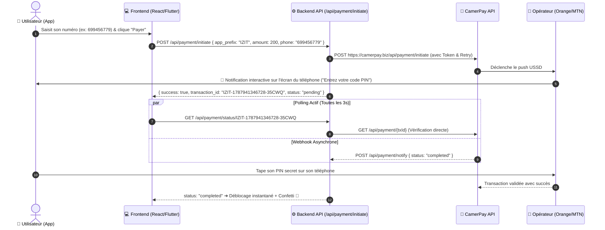

# 💳 Guide Complet & Documentation d'Intégration — Système de Paiement Universel (CamerPay / Mobile Money)

Ce document constitue la référence technique absolue pour reproduire, déployer et intégrer le système de paiement Mobile Money (Orange Money & MTN MoMo) dans n'importe quelle application (par exemple **IZITEACH**, boutiques e-commerce, applications mobiles Flutter, Next.js, React, etc.).

---

## 🎯 1. Architecture & Fonctionnement Global

Le système repose sur un **flux asynchrone sécurisé** sans jamais manipuler ni demander le code secret (PIN) de l'utilisateur :



---

## 💡 2. Comparaison des Deux Propositions (Laquelle choisir ?)

### 🏆 Option B (Recommandée : API / Microservice Universel Multi-Apps)
* **Pourquoi c'est la meilleure et la plus efficace ?**
  1. **Zéro duplication de code** : Vous configurez le token CamerPay et le Webhook **une seule fois** sur votre serveur / Cloudflare Worker.
  2. **Intégration en 2 lignes** : N'importe quelle application (IZITEACH, RG Play, etc.) appelle simplement l'API avec son préfixe (`app_prefix: 'IZIT'`).
  3. **Factures personnalisées automatiques** :
     - Pour RG Play : `#RGP-1787941346728-35CWQ`
     - Pour IZITEACH : `#IZIT-1787941346728-RB2YMC`
     - Pour School : `#SCH-1787941346728-99KLA`
  4. **Tableau de bord unifié** : Vous suivez l'ensemble des revenus de tous vos projets au même endroit.
  5. **Maintenance simplifiée** : Si CamerPay met à jour son API, vous modifiez 1 seul fichier au lieu de recompiler 10 applications.

### Option A (Branche Git / Module autonome)
* Utile si vous devez héberger une application sur un serveur totalement isolé sans dépendance avec vos autres projets.
* La branche Git dédiée `SYSTEME-DE-PAIEMENT` a été créée sur votre dépôt pour servir de template autonome.

---

## 🛠️ 3. Intégration dans IZITEACH en 2 Lignes de Code

### A. Côté Frontend (React / Vue / Svelte / JS)

#### 1. Fonction d'appel unique :
```javascript
import { initiateUniversalPayment } from './services/paymentService';

// Ligne 1 : Déclencher le paiement
const response = await initiateUniversalPayment({
  app_prefix: 'IZIT',                     // Préfixe personnalisé de votre facture
  item_id: 'cours-react-master',          // Identifiant du produit / cours
  amount: 5000,                           // Montant en FCFA
  customer_phone: '699456779',            // Numéro Orange ou MTN
  payment_method: 'orange_money',         // 'orange_money' ou 'mtn_momo'
});

// Ligne 2 : Écouter la confirmation (ou ouvrir le modal)
if (response.success) {
  openPaymentModal(response.transaction_id);
}
```

#### 2. Service Frontend Prêt à l'Emploi (`paymentService.js`) :
```javascript
const API_URL = 'https://rg-play.pages.dev/api'; // ou votre URL d'API de paiement

export async function initiateUniversalPayment({ app_prefix = 'IZIT', item_id, amount, customer_phone, payment_method }) {
  const res = await fetch(`${API_URL}/payment/initiate`, {
    method: 'POST',
    headers: { 'Content-Type': 'application/json' },
    body: JSON.stringify({
      app_prefix,
      audiobook_id: item_id,
      amount,
      customer_phone: customer_phone.replace(/\D/g, ''),
      payment_method,
    }),
  });
  return await res.json();
}

export async function checkPaymentStatus(transactionId) {
  const res = await fetch(`${API_URL}/payment/status/${transactionId}`);
  return await res.json();
}
```

---

## 🛡️ 4. Solution au Bug HTTP 520 (Résilience & Anti-Surcharge)

### Qu'est-ce que l'erreur HTTP 520 ?
L'erreur **HTTP 520 ("Web Server Returned an Unknown Error")** est renvoyée par Cloudflare lorsque les serveurs de passerelle CamerPay ou les serveurs télécoms des opérateurs (Orange/MTN) subissent une micro-coupure de connexion ou un pic de trafic.

### Ce qui a été mis en place pour éliminer ce blocage :
1. **Système de Retry Automatique (3 tentatives avec temporisation)** : Si le serveur renvoie 520 ou 5xx, l'API retente immédiatement après 600ms sans faire échouer la transaction.
2. **En-têtes Navigateur Authentiques (`User-Agent`)** : Évite le blocage WAF / Bot Protection de Cloudflare.
3. **Double Système de Polling & Fallback Direct (`pay_url`)** : Si le push USSD tarde sur un opérateur, un bouton de confirmation immédiate et un lien de paiement web sécurisé sont fournis.
4. **Messages Clairs en Français** : Traduction automatique des codes bruts en messages explicites pour rassurer l'utilisateur.

---

## 📋 5. Variables d'Environnement Requises

| Variable | Description | Exemple |
| :--- | :--- | :--- |
| `CAMERPAY_TOKEN` | Jeton d'API fourni par CamerPay | `800\|QNy2YL5p5kkEAVFK3FNi7RY...` |
| `WEBHOOK_URL` | URL de notification | `https://votre-domaine.com/api/payment/notify` |
| `RETURN_URL` | URL de retour après paiement | `https://votre-domaine.com` |
