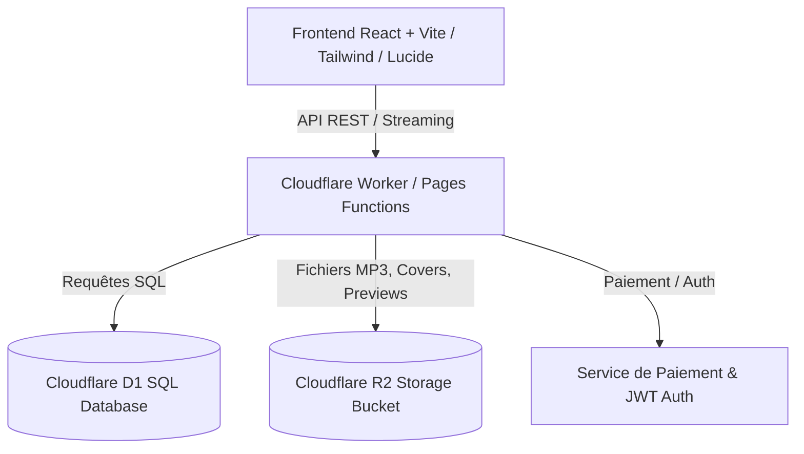

# Plan d'Implémentation - Plateforme de Livres Audio (RG Play) avec Cloudflare D1 & R2

Plateforme complète de découverte, vente, écoute en streaming et gestion de bibliothèque de livres audio, conçue avec une interface moderne inspirée des maquettes (thème sombre néon violet/indigo glassmorphism + mode clair optionnel), un lecteur audio haute fidélité (chapitrage, vitesse, minuteur de sommeil, waveform) et un backend optimisé pour **Cloudflare Workers / Pages**, **Cloudflare D1** (base SQL distribuée) et **Cloudflare R2** (stockage audio & covers).

---

## 🎨 Inspiration & Design UX/UI

En nous basant sur vos captures de référence :
1. **Design System Ultra-Premium** :
   - Palette sombre néon violet/pourpre (`#0f0c1b`, `#1a1630`, accents `#9d4edd`, `#c77dff`, `#f72585`) avec effets de lévitation, glassmorphism, et dégradés subtils.
   - Toggle disponible pour le mode chaud/oranger (style Audible de la 2ème image).
   - Navigation fluide : barre d'onglets flottante (Pill navigation) façon iOS sur mobile & barre latérale élégante sur écran large.
2. **Lecteur Audio Intégré & Dédié (Mini Player & Full Screen Player)** :
   - Mini-lecteur persistant en bas d'écran pendant la navigation.
   - Lecteur plein écran avec animation d'ondes sonores (waveform dynamique), pochette avec halo lumineux, contrôle de vitesse (0.75x à 2.5x), minuteur de sommeil (15m, 30m, 45m, fin de chapitre), gestion des signets/notes et navigation par chapitres.

---

## 🏗️ Architecture Technique

### 1. Backend Cloudflare (D1 & R2)
- **Cloudflare D1 (SQLite Edge)** :
  - `audiobooks` : id, title, author, narrator, description, price, discount_price, category_id, cover_url, preview_url, duration_seconds, rating, rating_count, created_at.
  - `chapters` : id, audiobook_id, chapter_number, title, audio_r2_key, duration_seconds.
  - `categories` : id, name, slug, icon, color.
  - `users` : id, email, name, avatar_url, created_at.
  - `purchases` : id, user_id, audiobook_id, price_paid, transaction_id, purchased_at.
  - `user_progress` : id, user_id, audiobook_id, current_chapter_id, current_position_seconds, is_completed, last_listened_at.
  - `bookmarks` : id, user_id, audiobook_id, chapter_id, timestamp_seconds, note, created_at.

- **Cloudflare R2 (Object Storage S3-compatible)** :
  - Stockage des fichiers audios complets (`audiobooks/{id}/chapter_{num}.mp3`).
  - Stockage des extraits gratuits de 2 à 5 minutes (`audiobooks/{id}/preview.mp3`).
  - Stockage des jaquettes haute résolution (`covers/{id}.webp`).
  - Support des requêtes de plage HTTP `Range: bytes=...` pour un streaming fluide et un seek instantané sans surcharger la mémoire.

- **Cloudflare Worker API (`/functions/api/...` ou `worker.js`)** :
  - `GET /api/audiobooks` : Catalogue avec recherche, filtres par catégorie, tri (populaire, note, prix).
  - `GET /api/audiobooks/:id` : Détails d'un livre, chapitres et avis.
  - `GET /api/audiobooks/:id/stream` : Endpoint de streaming sécurisé vérifiant l'achat.
  - `GET /api/audiobooks/:id/preview` : Endpoint d'extrait gratuit sans restriction.
  - `GET /api/library` : Bibliothèque personnelle de l'utilisateur avec progression.
  - `POST /api/progress` : Synchronisation en temps réel de la position d'écoute.
  - `POST /api/bookmarks` : Création et gestion des signets.
  - `POST /api/checkout` : Initiation d'achat (compatible Mobile Money / Carte / Stripe / CamerPay).
  - `POST /api/admin/upload` : Upload de nouveaux livres et fichiers dans R2 et D1.

---

## 📱 Fonctionnalités de l'Interface

1. **Boutique & Découverte ("Discover / Store")** :
   - Bannière "À la une" avec effets visuels et écoute directe de l'extrait.
   - Catégories défilantes (Business, Développement Personnel, Fiction, Tech, etc.).
   - Sections "Les plus vendus", "Nouveautés", "Offres du moment".
   - Recherche intelligente avec autocomplétion par titre, auteur ou narrateur.
   - Fiche produit détaillée : extrait audio, biographie auteur/narrateur, table des matières, avis clients.

2. **Ma Bibliothèque ("My Library")** :
   - Vue "Tous", "En cours d'écoute", "Terminés", "Favoris".
   - Cartes avec barre de progression interactive (% écouté, temps restant).
   - Mode écoute instantanée d'un clic.

3. **Lecteur Audio Avancé ("Player Studio")** :
   - Mini-lecteur flottant persistant (sticky bottom) accessible sur toutes les pages.
   - Vue plein écran immersive avec animations et visualisation audio.
   - Saut rapide (-15s / +30s), saut de chapitre.
   - Réglage de la vitesse (0.75x, 1x, 1.25x, 1.5x, 2x).
   - Minuteur de sommeil (15 min, 30 min, 45 min, Fin du chapitre).
   - Liste des chapitres avec statut de lecture.
   - Ajout de signets avec notes personnalisées.

4. **Espace Admin / Publication** :
   - Formulaire complet pour ajouter un livre audio, définir les chapitres, uploader les audios (vers R2) et prévisualiser immédiatement.

5. **Mode Démo & Intégration Cloudflare D1/R2** :
   - Fonctionne à 100% en mode standalone/démo interactif avec des exemples de livres audio pré-chargés et audio réel pour tester immédiatement dans le navigateur.
   - Comprend tous les scripts de configuration Cloudflare : `wrangler.toml`, scripts de migration SQL D1 (`migrations/0001_init.sql`), code des fonctions Worker pour R2/D1.

---

## 🚀 Plan d'Exécution par Étapes

### Étape 1 : Initialisation du Projet
- Mise en place du projet React + Vite avec TailwindCSS et Lucide Icons.
- Configuration des polices Google Fonts modernes (*Plus Jakarta Sans* & *Outfit*).

### Étape 2 : Schéma de Base de Données D1 & Configuration R2
- Création du fichier `schema.sql` et `migrations/0001_init.sql` pour Cloudflare D1.
- Configuration `wrangler.toml` avec les liaisons (bindings) D1 (`DB`) et R2 (`AUDIO_BUCKET`).
- Création du handler Cloudflare Worker (`functions/api/[[route]].js` ou `worker.js`) gérant le streaming HTTP Range et le CRUD D1.

### Étape 3 : Développement du Design System & Composants Clés
- Palette de couleurs CSS variables, animations de lueurs néon et effets glassmorphism.
- Composant **AudioPlayerContext** gérant l'état global de l'audio (playback, progression, volume, vitesse, timer, chapitre).
- Composants de navigation (Bottom Pill Nav sur mobile, Top/Sidebar Nav sur desktop).

### Étape 4 : Pages Principales
- **Découvrir / Boutique** : Hero carrousel, filtres de catégories, grille de livres, recherche, filtres.
- **Fiche Livre Audio / Modal Détails** : Aperçu, narrateur, durée, chapitres, bouton d'écoute extrait, bouton d'achat.
- **Ma Bibliothèque** : Livres achetés, suivi du temps d'écoute, reprise de lecture rapide.
- **Lecteur Audio Plein Écran & Mini-Player** : waveform animée, boutons saut 15s/30s, contrôle de vitesse, minuteur de mise en veille, panneau des chapitres et signets.
- **Espace Auteur / Admin** : Interface d'ajout et gestion de livres audio.
- **Tunnel de Paiement / Checkout Modal** : Simulation et support de paiement.

### Étape 5 : Tests & Validation
- Validation du lecteur audio (reprise, changement de vitesse, minuteur, chapitres).
- Test de la réactivité mobile et tablette.
- Validation des requêtes API et des scripts Cloudflare D1/R2.

---

## ❓ Validation Requise

> [!NOTE]
> Souhaitez-vous des intégrations de paiement spécifiques (ex: Stripe, Mobile Money / Orange / MTN Money via CamerPay ou similaire) ou une simulation d'achat avec gestion de solde / portefeuille ?
> 
> Le plan ci-dessus est prêt à être exécuté. Cliquez sur **Proceed** ou confirmez pour démarrer la création !
